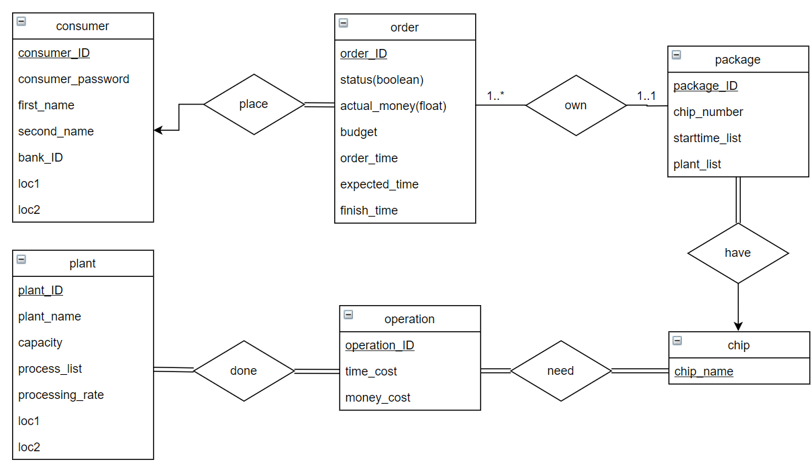

# CSC3170 Course Project

## Project Overall Description

This is our implementation for the course project of CSC3170, 2022 Fall, CUHK(SZ). For details of the project, you can refer to [project-description.md](project-description.md). In this project, we will utilize what we learned in the lectures and tutorials in the course, and implement either one of the following major jobs:

<!-- Please fill in "x" to replace the blank space between "[]" to tick the todo item; it's ticked on the first one by default. -->

- [x] **Application with Database System(s)**
- [ ] **Implementation of a Database System**

## Team Members

Our team consists of the following members, listed in the table below (the team leader is shown in the first row, and is marked with 🚩 behind his/her name):

<!-- change the info below to be the real case -->

| Student ID | Student Name | GitHub Account (in Email) | GiHub Username |
| ---------- | ------------ | ------------------------- | -------------- |
| 120090175  | 彭乔羽 🚩    | 120090175@link.cuhk.edu.cn  | KillerPQY |
| 120090661  | 邓毅轩         | 939681959@qq.com           | wek-deng |
| 120090443  | 周昱潇         | 120090443@link.cuhk.edu.cn            |undo|
| 120090737  | 刘宇轩         | 120090737@link.cuhk.edu.cn            |undo|
| 120040088  | 王熹           | 120040088@link.cuhk.edu.cn            |iamgeorge|
| 120090721  | 熊一鸣         | 120090721@link.cuhk.edu.cn            |undo|
| 120010035  | 黄熹正         | 120010035@link.cuhk.edu.cn            |undo|
| 120010061  | 林泽昕         | 120010061@link.cuhk.edu.cn            |webDrag0n|
| 120090638  | 孙绍强         | 120090638@link.cuhk.edu.cn            |undo|
| 120090673  | 曲恒毅         | qulend@163.com            |undo|

## Project Specification

<!-- You should remove the terms/sentence that is not necessary considering your option/branch/difficulty choice -->

After thorough discussion, our team made the choice and the specification information is listed below:

- Our option choice is: **Option 1**
- Our branch choice is: **Branch 1 and Branch 2**
- The difficulty level is: **Enhanced**

## Project Abstract

<!-- TODO -->
Our system provides users with a convenient platform to purchase chips. It is committed to reducing users' money and time costs and improving the production capacity and efficiency of the chip industry. Our project can bring a qualitative leap to the industry.

To accomplish our vision, we implemented three separate systems. First, we will provide users with a simple, elegant, and easy-to-use web interface. Users can obtain intimate and customized services on the website. Besides, our accurate and powerful data analysis system can provide a solid technical foundation for this service. In addition, our independent and safe banking system guarantees the stability and timeliness of transactions.

## Progress Report

### 1. Trading System Front-End

We designed and produced a robust, elegant, and easy-to-use front-end interface. Aiming to provide the user with the best user experience and productivity.

The front-end interface has mainly four pages:

1.	Login page
2.	Order list page
3.	Order making page
4.	Factory info page

On the login page, the user could log in with his user id and password. After login, we can link the user id with the orders made by the user and fill up the order list page. The order list page is a page that shows all the processing orders. If the user wishes to make a new order, he/she could first go to the factory info page and look up detailed information about a specific factory. Including name, location, the number of machines, types of chips that could be produced by the machines in the factory, and more. With the knowledge of factory details, the user could select from a range of dropdown lists. The user-designed chip ordering plan will be sent to the backend data analysis module and receive a score towards the plan. If the plan can be executed, the front-end interface will tell the user to confirm the plan and place the order; then, the user will go back to the order list page. Otherwise, the user will be prompted with an error message that asks for a redesign of the ordering plan.

Finite state machine diagram:

### 2. Trading System Back-End

Firstly, a simple ER diagram is designed based on the requirements and some elaboration provided by the project guideline:

We assume the customer will provide an order with different sets of chips and different volumes. Then, the system, designed by the team, will provide a score for these ordering decisions. After that, this order will be executed by the system, where relevant information will be stored in our database. Lastly, all responses and feedback will be replied back by the back-end system to the web to display all necessary information about this order.

We decide to use MySQL for this project. The next priority is to write a connector that connects MySQL and the back-end system (python based). Fortunately, MySQL-python connector can perform the job really well. So, we first wrote a simple script to create all tables provided by the ER-diagram above:

### 3. Target Analysis

A data analysis team is set up to analyze the user's input production policy and return the score (KPI) for that policy. This team will further study the influence of each variable on the output KPI.

Until now, our data analysis team generated the distribution of KPIs based on random simulation and calculated the KPI for input production policy. The programs are written in python and are expected to be slightly modified to fit the front and back end. 

Our random simulation algorithm involves a  utilization of Kernel Density Estimation (KDE) to estimate the approximate distribution and transform it into a continuous distribution. The score is denoted as $1 - CDF$, which indicates the percentage rank of this user's decision plan among all other plans for the same package.

We are now in the process of interfacing our algorithm with the back and front ends. And we will study the influence of each variable on the output KPI later.
